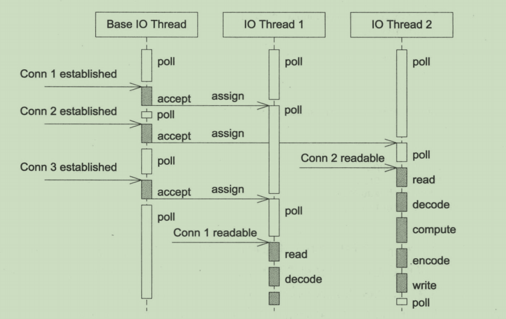
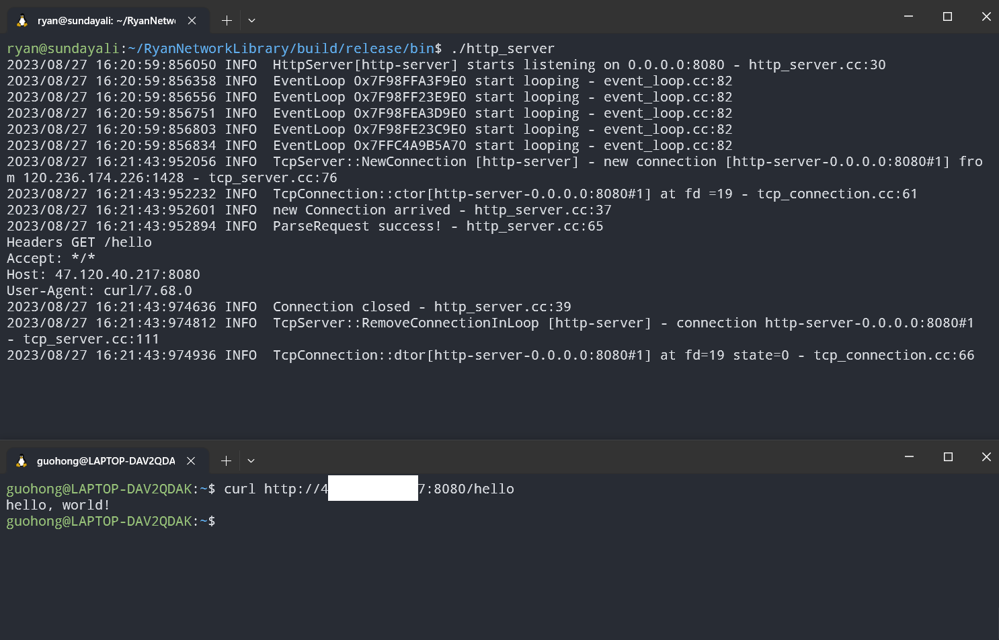
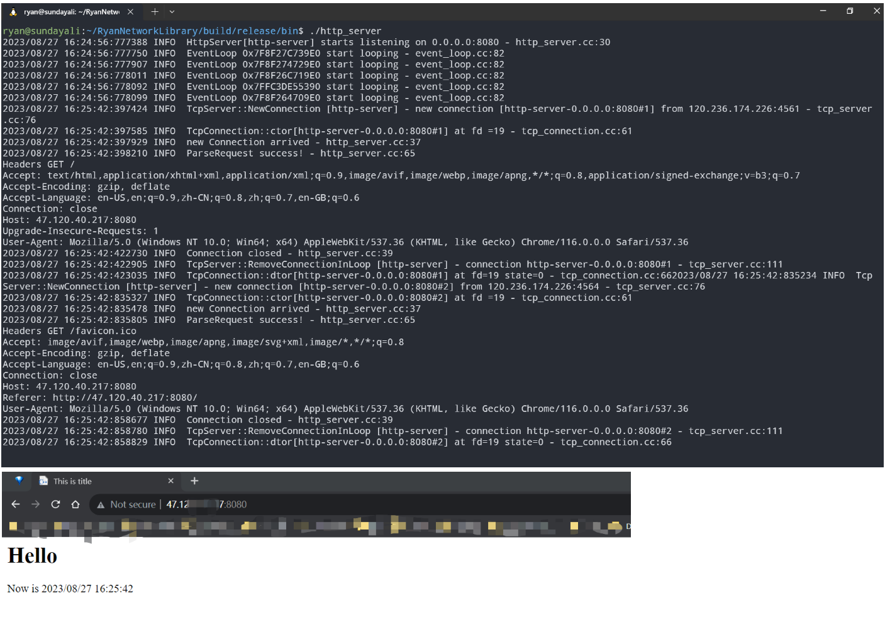

# RyanNetworkLibrary
基于 `Reactor` 模型的 `Linux C++` 多线程网络库

## 项目介绍

本项目是参考 `muduo` 实现的基于 `Reactor` 模型的多线程网络库。


这个项目作为本人的网络编程学习和练手项目，的是利用从头编写写网络库，学习多线程网络程序的各种编程模型和最佳实践。


本项目主要作为一个练习项目，因此只实现了muduo的部分功能，如 `thread_pool`、`buffer`、`async_logger`、`poller`、`event_loop`、`tcp_server` 等。

而没有实现 `tcp_client`、`time_zone`、`protobuf`、`protorpc`、`inspect` 等功能。


主要基于 `C++11` 编写，也用到了少部分 `C++17` 特性 (如 `std::any` 等)。


## 项目特点

- 底层使用 `Epoll + LT` 模式的 `I/O` 复用模型，并且结合非阻塞 `I/O`  实现 `主从 Reactor` 模型。
- 主要采用 `one-loop-per-thread` 线程模型，`loop threads` 的数量在程序开始时设定并固定，充分利用多核CPU。同时提供线程池的封装用于处理计算，避免线程频繁创建和销毁带来的性能开销，即支持 `one-loop-per-thread + thread-pool` 。
- 基于自实现的双缓冲区实现异步日志，由后端线程负责定时向磁盘写入前端日志信息，避免数据落盘时阻塞网络服务。
- 使用 `Linux` 的 `timerfd` 通知到期任务，将定时任务与事件循环高效结合，用统一的方式处理 `I/O` 事件和定时事件。使用 `std::map` (底层使用红黑树) 管理定时任务。
- 遵循 `RAII` 管理资源，如使用智能指针管理内存，使用 `RAII` 类封装 `socket fd` 的打开关闭，减小`resource leak`风险。
- 基于本项目实现的网络库, 实现了一个简易的 `http` 库, 利用有限状态机解析 `HTTP` 请求报文。
- 使用 `gtest` 进行单元测试

*另外两个补充的部分作为练手，并没有使用到上述实现的网络库，主要是为了顺便熟悉一下资源池化技术*

- 实现了一个简易的内存池模块，更好管理小块内存空间，减少内存碎片。
- 实现了一个简易的 `Mysql` 数据库连接池, 可以动态管理连接数量，及时生成或销毁连接，保证连接池性能。

## 开发环境

- 操作系统：`Ubuntu 20.04 LTS`
- 编译器：`clang++ 10.0.0-4ubuntu1`
- 编辑器：`vscode`
- 版本控制：`git`
- 项目构建：`cmake 3.16.3`

## 并发模型

**1. `one-loop-per-thread`**


项目主要采用 `主从 Reactor` 模型，`MainReactor` 只负责监听派发新连接，在 `MainReactor` 中通过 `Acceptor` 接收新连接并轮询派发给 `SubReactor`，`SubReactor` 负责此连接的读写事件(即`one-loop-per-thread`)。

每个 `I/O` 线程独立运行一个事件循环，即 `SubReactor`。处理读写事件的 `SubReactor` 数量固定，在程序开始时设定或者通过命令行传入，一般和 `CPU` 核心数相等, 以充分利用多核 `CPU`。


**2. `one-loop-per-thread + thread-pool`**


同时本项目也支持 "既使用多个 `Reactor` 来处理 `I/O`, 又使用线程池来处理计算" 的并发模型(即 `one-loop-per-thread + thread-pool`)。

## 构建项目
项目依赖
- `cmake`
- `mysql client for c++`
```shell
sudo apt update
sudo apt install libmysqlclient-dev
```
- `gtest` (optional, for test)
- `gmock` (optional, for test)
- `boost` (optional, for test)
- 

下载项目

```shell
git clone git@github.com:GuohongXie/RyanNetworkLibrary.git
```

执行脚本构建项目

```shell
cd ./RyanNetworkLibrary && bash build.sh
```

## Examples
### echo_server

`echo_server`默认监听端口为`18080`

```shell
cd ./build/release/bin/ && ./echo_server
```

执行情况：


### http_server

`examples`中有一个小型的`HTTP`服务器, 其默认监听`8080`.
可支持 `GET` 请求和静态资源的访问，且附有异步日志监控服务端情况

```shell
cd ./build/release/bin/ && ./http_server
```




## TODO

1. 覆盖更多的单元测试

## Acknowledgments

- 《Linux多线程服务端编程：使用muduo C++网络库》陈硕 著
- https://github.com/chenshuo/muduo
- 《Linux高性能服务器编程》 游双 著
- 《TCP/IP Illustrated Volume 1: The Protocols》 second Edition by *W.Richard Stevens*
